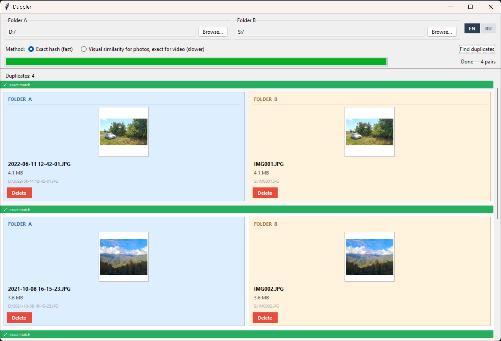

# Duppler

A desktop tool for finding and removing duplicate photos and videos across two folders — even if the files were renamed by cloud storage.



## Use case

You have two folders with ~70% overlapping content: one is a phone backup, the other is downloaded from cloud storage. The files are the same but have different names. Duppler finds matching pairs, shows a preview, and lets you delete one file at a time — straight to the Recycle Bin.

Supports `.jpg` / `.jpeg` / `.mp4`.

## Install

```
pip install -r requirements.txt
```

## Run

```
python -m duppler
```

## How it works

**Exact hash (default)** — groups files by size, then compares blake2b checksums. Fast and 100% accurate for byte-identical files.

**Visual similarity** — uses perceptual hashing (pHash) for photos and exact hash for video. Catches images re-compressed or stripped of metadata by cloud services. Slower.

Both previews are shown for each duplicate pair so you can visually confirm before deleting.
